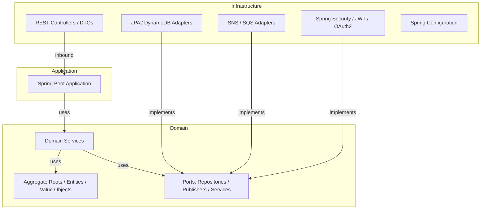

# Architecture

This document describes the high-level design of the Spring Chess backend. It covers the hexagonal / Domain-Driven Design (DDD) style, service boundaries, cross-service messaging, data stores, security model, and known trade-offs.

## 1. Architectural style

The project follows **Hexagonal Architecture (Ports & Adapters)** combined with **Domain-Driven Design**.



### Key principles

- **Domain purity**: The `com.chess.<service>.domain` packages contain no Spring or AWS dependencies. Business invariants live in the aggregate roots and value objects.
- **Ports are interfaces**: Repository, publisher, and external-service interfaces are defined in the domain layer.
- **Adapters live in infrastructure**: JPA repositories, SNS/SQS clients, REST controllers, and security filters implement the ports.
- **Each service owns its data**: No service reads another service's database directly. Integration is either synchronous REST between bounded contexts or asynchronous SNS/SQS events.

## 2. Service boundaries and aggregate roots

| Service | Aggregate roots | Key value objects | Main domain services | Notes |
|---|---|---|---|---|
| `auth` | `User` | `UserId`, `Username`, `Email`, `Password`, `AuthToken` | `UserRegistrationService`, `UserLoginService`, `TokenAuthenticationService`, `PasswordRecoveryService` | Publishes `user-events`; consumes `match-events.fifo`. |
| `social` | `Guild`, `Friendship`, `UserProfile` | `GuildId`, `GuildName`, `FriendshipId`, `UserId`, `CategoryId`, `RankId`, `RankPermission` | `GuildDomainService`, `FriendshipDomainService` | Publishes `social-events`; consumes `user-events` and `match-events.fifo`. |
| `chat` | `ChatRoom`, `Message` | `ChatRoomId`, `MessageId`, `UserId`, `MessageContent`, `RoomTitle` | `ChatRoomDomainService`, `MessageDomainService` | Publishes `chat-events`; consumes `user-events`. |
| `game` | `Game` | `GameId`, `PlayerId`, `Position`, `Piece`, `PieceType`, `Move`, `GameClock`, `GameResult` | `GameDomainService` | Publishes `game-events`; consumes `user-events`. |

### 2.1 `auth` aggregate

- **`User`** is the only aggregate root.
- It protects the `refreshTokenVersion`. Every password change or successful token refresh increments it, which is used to revoke old refresh tokens.
- Value-object-level validation: `Email`, `Username`, `Password` (regex `^(?=.*[A-Z])(?=.*\d)(?=.*[^A-Za-z0-9]).{8,}$`).

### 2.2 `social` aggregates

- **`Guild`**: owns `GuildCategory`, `GuildRank`, and `GuildMember`. The creator becomes the owner and receives a default `Leader` rank. Ranks carry `RankPermission` values such as `CHAT_ACCESS`, `INVITE_MEMBERS`, `KICK_MEMBERS`, `MANAGE_RANKS`, `MANAGE_CATEGORIES`, `MANAGE_MEMBERS`, and `POST_ANNOUNCEMENTS`.
- **`Friendship`**: captures the relationship lifecycle (`PENDING`, `ACCEPTED`, `DECLINED`, `BLOCKED`) and enforces transition rules.
- **`UserProfile`**: display name, avatar, and status message.

### 2.3 `chat` aggregates

- **`ChatRoom`**: supports `DIRECT`, `GROUP`, `GUILD`, and `MATCH` room types. Direct rooms cannot receive additional participants; management requires `OWNER` or `ADMIN` role.
- **`Message`**: text/system/image/game-invite/chess-move-annotation types, with lifecycle `SENT`, `DELIVERED`, `READ`, `EDITED`, `DELETED`. Reactions, threaded replies, soft deletion, and edit rules are enforced inside the aggregate.
- **Ordering**: messages are persisted with a `sequence` column and ordered by `(sentAt, sequence)` to maintain a stable timeline.
- **Guild access**: when sending a message in a `GUILD` room, the service calls the `social` permission endpoint and requires `CHAT_ACCESS` on the linked guild.

### 2.4 `game` aggregate

- **`Game`**: encapsulates an 8x8 board, piece rules, turn enforcement, move validation, game status (`WAITING_FOR_OPPONENT`, `IN_PROGRESS`, `CHECK`, `CHECKMATE`, `STALEMATE`, `DRAW_BY_FIFTY_MOVE_RULE`, `RESIGNED`, etc.), clock state, and move history.
- **`GameHistoryRecord`**: an immutable value object representing a single move, stored in DynamoDB with a composite key of `gameId` (hash) and `moveNumber` (range).
- `GameDomainService` publishes `GAME_CREATED`, `GAME_STARTED`, `MOVE_MADE`, and `GAME_ENDED` events.

## 3. Cross-service event flow

SNS is used as a fan-out bus; each consumer has its own SQS queue. Most queues are backed by a Dead-Letter Queue (DLQ) with a `maxReceiveCount` of 5, as provisioned by `localstack/init-aws.sh`.

### SNS topics

| Topic | Type | Owner | Subscribers / consumers |
|---|---|---|---|
| `user-events` | Standard | `auth` | `social-user-events-queue` (`social`), `chat-user-events-queue` (`chat`), `game-user-events-queue` (`game`), `analytics-user-events-queue` (placeholder) |
| `match-events.fifo` | FIFO | used elsewhere in the platform | `auth-match-events-queue.fifo` (`auth`), `social-match-events-queue.fifo` (`social`), `analytics-match-events-queue.fifo` (placeholder) |
| `social-events` | Standard | `social` | `analytics-social-events-queue` (placeholder) |
| `chat-events` | Standard | `chat` | (no SQS subscriptions provisioned yet) |
| `game-events` | Standard | `game` | (no SQS subscriptions provisioned yet) |

### SQS queues created by `init-aws.sh`

| Queue | Listens to | Consumer service | DLQ |
|---|---|---|---|
| `social-user-events-queue` | `user-events` | `social` | `social-user-events-dlq` |
| `chat-user-events-queue` | `user-events` | `chat` | `chat-user-events-dlq` |
| `analytics-user-events-queue` | `user-events` | — (placeholder) | `analytics-user-events-dlq` |
| `auth-match-events-queue.fifo` | `match-events.fifo` | `auth` | `auth-match-events-dlq.fifo` |
| `social-match-events-queue.fifo` | `match-events.fifo` | `social` | `social-match-events-dlq.fifo` |
| `analytics-match-events-queue.fifo` | `match-events.fifo` | — (placeholder) | `analytics-match-events-dlq.fifo` |
| `analytics-social-events-queue` | `social-events` | — (placeholder) | `analytics-social-events-dlq` |

### Trace propagation

`auth` and `social` include a `traceId` message attribute on SNS publishes. SQS listeners read that attribute and put it in the MDC so logs can be correlated, even though end-to-end distributed tracing is only exported by `auth` at this time.

### Notes on `game-events`

- The `game` service publishes to a **standard** SNS topic named `game-events`.
- It does **not** publish to the FIFO `match-events.fifo` topic; `match-events.fifo` is reserved for other match-related flows.
- The current `localstack/init-aws.sh` does not create the `game-events` topic or the `game-user-events-queue`. They must be created manually until the script is updated.

## 4. Data stores

| Service | Primary state | Technology | Notes |
|---|---|---|---|
| `auth` | User accounts, email, password hash, refresh token version | PostgreSQL `auth_db` | Spring Data JPA. |
| `auth` | Revoked access token blacklist | Redis | TTL-based, stores tokens for remaining access-token lifetime. |
| `auth` | Outbound password-recovery email (dev) | MailHog | SMTP on port `1025`, web UI on `8025`. |
| `social` | Guilds, friendships, profiles | PostgreSQL `social_db` | Spring Data JPA. |
| `chat` | Chat rooms, participants, messages, reactions | PostgreSQL `chat_db` | Spring Data JPA. |
| `game` | Active game state | PostgreSQL `game_db` | Spring Data JPA (`GameJpaEntity`). |
| `game` | Move history | DynamoDB `game-history` | Partition key `gameId` (String), sort key `moveNumber` (Number), provisioned on-demand. |
| `observation` | Metrics | Prometheus | Scrapes `/actuator/prometheus` from `auth`. |
| `observation` | Traces | Grafana Tempo | Receives OTLP on `4317`/`4318`; stores blocks in S3/LocalStack. |
| `observation` | Logs | Grafana Loki | Ingests logs; Promtail reads Docker container logs. |
| `observation` | Dashboards | Grafana | Port `3000`. |

## 5. Security model

### 5.1 Token issuance (`auth`)

- `auth` owns a 2048-bit RSA key pair (`RsaKeyPairProvider`), persisted in `.keys/` unless explicit PEM keys are provided.
- **Access token**: signed with the private key using `RS256`. Contains `sub` = `userId`, `username`, `email`, `type=access`, `exp` = 1 hour.
- **Refresh token**: signed with the private key. Contains `sub` = `email`, `type=refresh`, `refreshTokenVersion`, `exp` = 7 days.
- **JWKS**: public key material is exposed at `GET /.well-known/jwks.json` (key id `auth-key-1`).

### 5.2 Token validation (resource servers)

- `social`, `chat`, and `game` configure Spring Security as OAuth2 resource servers:

  ```yaml
  spring:
    security:
      oauth2:
        resourceserver:
          jwt:
            jwk-set-uri: http://localhost:8080/.well-known/jwks.json
  ```

- All endpoints except Swagger, OpenAPI docs, and actuator require a valid Bearer token.

### 5.3 Refresh token lifecycle

- On `/api/v1/auth/refresh`, the service extracts `refreshTokenVersion` and `email`, compares the version to the stored `User.refreshTokenVersion`, and only issues a new pair if they match.
- A successful refresh increments `refreshTokenVersion`, rendering the old refresh token unusable.
- `User.changePassword()` increments `refreshTokenVersion`, so a password change invalidates all existing refresh tokens.

### 5.4 Logout and token blacklist

- `/api/v1/auth/logout` extracts the access token and stores it in Redis for the remaining token TTL using `RedisTokenBlacklistAdapter`.
- The `TokenAuthenticationService` can check whether a token is blacklisted.

### 5.5 Password policy

Passwords must satisfy the regex:

```
^(?=.*[A-Z])(?=.*\d)(?=.*[^A-Za-z0-9]).{8,}$
```

At least one uppercase letter, one digit, one special character, and a minimum length of 8.

## 6. LocalStack and observability setup

### LocalStack

LocalStack emulates AWS services in `auth/docker-compose.yml`, `social/docker-compose.yml`, and `game/docker-compose.yml`. The `chat/docker-compose.yml` uses a plain PostgreSQL container because it does not need LocalStack at runtime.

`localstack/init-aws.sh` runs automatically from `/etc/localstack/init/ready.d/` and creates:

- S3 bucket `tempo-traces`.
- SNS topics: `user-events`, `match-events.fifo`, `social-events`, `chat-events`.
- SQS queues and DLQs listed above.
- RDS PostgreSQL instances: `auth_db`, `social_db`, `chat_db`, `game_db`.
- DynamoDB table `game-history`.

### Observability

The `observation` stack is a self-hosted LGTM setup:

- **Prometheus** scrapes metrics on port `9090`.
- **Grafana Tempo** receives OTLP traces on `4317` (gRPC) and `4318` (HTTP) and stores them in S3 (`tempo-traces` bucket).
- **Grafana Loki** aggregates logs on port `3100`.
- **Promtail** forwards Docker container logs to Loki.
- **Grafana** visualizes everything on port `3000`.

Only `auth` is fully instrumented:

- `micrometer-tracing-bridge-otel` and `opentelemetry-exporter-otlp`.
- `logstash-logback-encoder` for JSON log output.
- Actuator exposes `health`, `info`, `metrics`, `prometheus`.

`social`, `chat`, and `game` include Spring Security and can validate JWTs, but they do not currently export traces or metrics. Prometheus only has a scrape target for `auth-service` in the provided `prometheus.yml`.

## 7. Trade-offs and known limitations

1. **Chat is REST/polling, not WebSocket.** The chat service exposes synchronous REST endpoints and uses a `sequence` column for message ordering. Real-time delivery requires the client to poll.

2. **Tracing and metrics are partial.** Only `auth` exports OTLP traces, Prometheus metrics, and structured JSON logs. `social`, `chat`, and `game` have security stubs but no complete trace export.

3. **CI only covers `auth` and `social`.** `.github/workflows/ci.yml` and `build.yml` run `mvn clean verify` only for `auth` and `social`. `chat` and `game` are not built in CI, and there is no branch protection or deployment stage.

4. **LocalStack `game-events` not provisioned.** The `game` service references a `game-events` SNS topic and a `game-user-events-queue`, but `localstack/init-aws.sh` currently does not create them. They must be added to the script or created manually.

5. **One LocalStack instance per host.** Each service `docker-compose.yml` declares a LocalStack container named `chess-localstack` binding to port `4566`. You can only run one of those compose files at a time on the same Docker host. For a full local stack, start one LocalStack instance and run the other Spring Boot services directly.

6. **Observability S3 backend is LocalStack, not MinIO.** Tempo is configured to store traces in the LocalStack S3 bucket `tempo-traces` at `host.docker.internal:4566`. The `observation` stack does not include a MinIO container.
