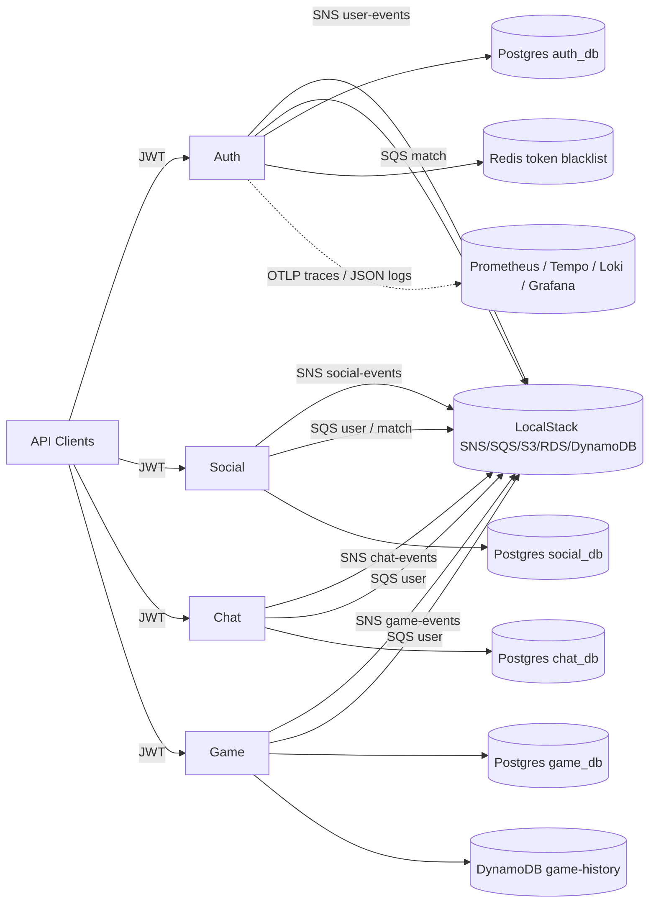

# Spring Chess (Backend)

A Spring Boot 3 (Java 17) domain-driven microservices platform for online chess. The repository contains the backend services only; clients call the REST APIs directly.

Each service is organized as a hexagonal/DDD module with its own `pom.xml`, `docker-compose.yml`, and `application.yml`. Local development is backed by [LocalStack](https://www.localstack.cloud/) to emulate AWS SNS, SQS, S3, RDS, and DynamoDB, plus the `observation` directory for the LGTM (Loki, Grafana, Tempo, Prometheus) telemetry stack.

## System overview



## Services

| Service | Port | Primary data store | Purpose | README |
|---|---|---|---|---|
| `auth` | 8080 | PostgreSQL `auth_db` + Redis | Authentication, RSA-signed JWTs, JWKS, password recovery, user events | [auth/README.md](./auth/README.md) |
| `social` | 8081 | PostgreSQL `social_db` | Friendships, guilds, ranks, profiles, social events | [social/README.md](./social/README.md) |
| `chat` | 8082 | PostgreSQL `chat_db` | REST-based chat rooms (DIRECT, GROUP, GUILD, MATCH), messages, reactions | [chat/README.md](./chat/README.md) |
| `game` | 8083 | PostgreSQL `game_db` + DynamoDB `game-history` | Chess game engine, move validation, game state, game events | [game/README.md](./game/README.md) |
| `observation` | 3000, 9090, 3200, 3100 | Prometheus / Tempo / Loki / Grafana | Metrics, traces, logs stack | [observation/README.md](./observation/README.md) |

## Quick start

### 1. Clone the repository

```bash
git clone https://github.com/LuisHBarros/spring-chess.git
cd spring-chess
```

### 2. Create the root `.env`

Database passwords live in a single root `.env` file that is git-ignored. Create it at the repository root:

```bash
# .env
AUTH_DB_PASSWORD=auth_pass
SOCIAL_DB_PASSWORD=social_pass
CHAT_DB_PASSWORD=chat_pass
GAME_DB_PASSWORD=game_pass
```

Each `application.yml` imports it with:

```yaml
spring.config.import: optional:file:../.env[.properties]
```

and each `docker-compose.yml` loads it with:

```yaml
env_file:
  - ../.env
```

### 3. Start LocalStack and supporting infrastructure

The project uses LocalStack to emulate the AWS services required by all microservices. Because every `docker-compose.yml` declares a LocalStack container on the same host port (`4566`), start only one LocalStack instance at a time. The `auth` compose also brings up Redis and MailHog:

```bash
docker compose -f auth/docker-compose.yml up -d
```

Wait for `awslocal s3 ls` to succeed inside the container.

### 4. Initialize AWS local resources

The `localstack/init-aws.sh` script is mounted to `/etc/localstack/init/ready.d/init-aws.sh` and is normally executed automatically by LocalStack once it is ready. If you need to re-run it manually:

```bash
docker exec chess-localstack /etc/localstack/init/ready.d/init-aws.sh
```

This creates the SNS topics, SQS queues, RDS PostgreSQL databases, DynamoDB tables, and the `tempo-traces` S3 bucket.

### 5. Start the Spring Boot services

From each service directory run:

```bash
cd auth   && mvn spring-boot:run
cd social && mvn spring-boot:run
cd chat   && mvn spring-boot:run
cd game   && mvn spring-boot:run
```

Use separate terminal windows, or run them with different host port/database overrides as needed.

### 6. Open Swagger UI and health endpoints

| Service | Swagger UI | Actuator health |
|---|---|---|
| `auth` | http://localhost:8080/swagger-ui.html | http://localhost:8080/actuator/health |
| `social` | http://localhost:8081/swagger-ui.html | not configured |
| `chat` | http://localhost:8082/swagger-ui.html | not configured |
| `game` | http://localhost:8083/swagger-ui.html | http://localhost:8083/actuator/health |

The JWKS endpoint for token validation is:

```
http://localhost:8080/.well-known/jwks.json
```

The observability stack can be started with:

```bash
docker compose -f observation/docker-compose.yml up -d
```

Grafana is then available at http://localhost:3000 (default `admin` / `admin`).

## Testing and CI

### Local verification

The `auth` and `social` services enforce a JaCoCo 80% line-coverage threshold:

```bash
cd auth
mvn clean verify

cd ../social
mvn clean verify
```

`chat` and `game` are not yet wired into the CI pipeline, but can still be built and tested locally:

```bash
cd chat
mvn clean test

cd ../game
mvn clean test
```

### GitHub Actions

Two workflows live under `.github/workflows/`:

- `ci.yml` — runs `mvn clean verify` for `auth` and `social` inside service containers (PostgreSQL, Redis, MailHog) and uploads JaCoCo reports.
- `build.yml` — runs the same verification plus SonarCloud analysis when `SONAR_TOKEN` is available.

The CI workflows intentionally do **not** cover `chat` or `game`, and there is no branch protection or deployment stage.

## Security and authentication

- `auth` issues RSA-signed (`RS256`) short-lived access tokens and long-lived refresh tokens.
- The refresh token rotates: each successful refresh increments a stored version on the `User` aggregate; a password change also increments that version, invalidating existing refresh tokens.
- Logout blacklists the current access token in Redis for its remaining TTL.
- Other services (`social`, `chat`, `game`) are OAuth2 resource servers that validate tokens against the `auth` JWKS endpoint at `http://localhost:8080/.well-known/jwks.json`.
- Passwords must match the regex `^(?=.*[A-Z])(?=.*\d)(?=.*[^A-Za-z0-9]).{8,}$`.

## Configuration and secrets

- The root `.env` is the single source of truth for database passwords and is ignored by Git.
- Do **not** commit the `.env` file or the generated `.keys/` directory (used by `auth` for the local RSA key pair).
- Environment-specific values can be overridden with standard Spring Boot externalized configuration.

## Observability

All microservices are wired for observability:

- Actuator endpoints exposed: `health`, `info`, `metrics`, `prometheus`.
- Prometheus `jvm_` and `http_` metrics via Micrometer, tagged with `application`.
- OpenTelemetry OTLP trace export to Tempo (default `http://localhost:4318/v1/traces`).
- Structured JSON logs using the Logstash encoder, suitable for Loki/Promtail ingestion.
- Trace propagation through SNS/SQS message attributes.

See [observation/README.md](./observation/README.md) for the LGTM stack details and the
`docker-compose.swarm.yml` at the repository root for a full Docker Swarm deployment.

## Contributing

1. Open a feature branch from `development`.
2. Add or update domain and infrastructure tests for the affected service.
3. Run `mvn clean verify` in `auth` and `social` before pushing.
4. Open a pull request. The CI pipeline will run the `auth` and `social` checks.

For a deeper view of the architecture, aggregate roots, and event flow, see [ARCHITECTURE.md](./ARCHITECTURE.md). Development conventions will be documented in [DEVELOPMENT.md](./DEVELOPMENT.md).
